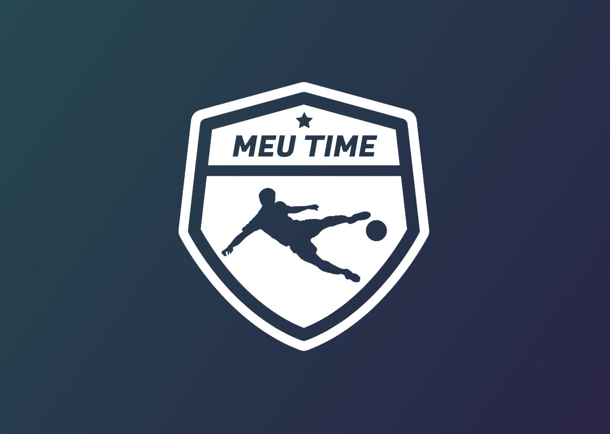

<p align="center">
  <a href="https://nextjs.org" target="blank">
    
  </a>
</p>

  <p align="center">A progressive <a href="https://nextjs.org" target="_blank">Next.js</a> framework for building efficient and scalable web applications.</p>

## Links

+ Figma: <a href="https://www.figma.com/file/GWOaHv6If8XNJGa1FrqJfa/Meu-Time-%E2%9A%BD?type=design&node-id=15%3A264&t=5CA6dXyXP3pwNUfQ-1" target="_blank">Designer do projeto</a>

## Instalação

```bash
$ npm install
```

## Running the app

```bash
# watch mode
$ npm run dev
```

</br>

> Status: Desenvolvimento

</br>

## WebSite desenvolvida para a empresa Trade Technology como teste para vaga de Desenvovedor web.

<br/>

## 🧪 Tecnologias usadas:

+ Next
+ Sass
+ TypeScript
